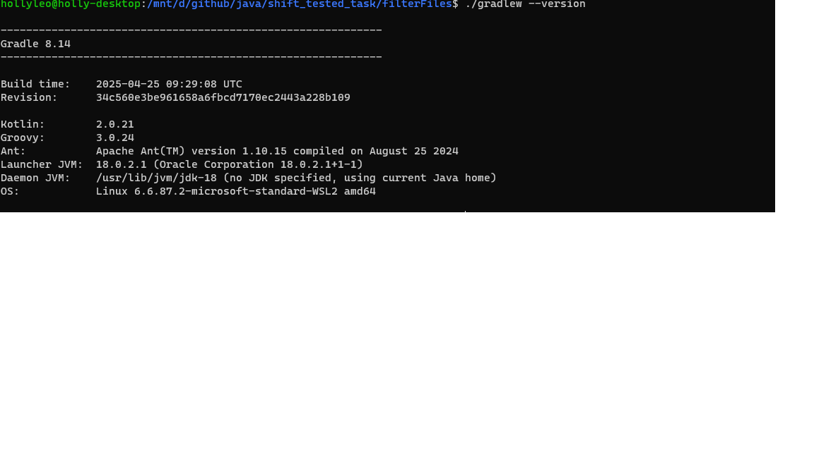

## Утилита фильтрации содержимого файлов

### Java and Gradle version

### Используемые библиотеки
- Apache commons cli для обработки аргументов консольного интерфейса
- slf4 и logback-classic для логирования и вывода статистики
- lombok для упрощения работы с шаблонным кодом
- плагин shadow для работы jar с установленными зависимостями
### Запуск программы
- Билдим jar командой gradle shadowJar или gradlew shadowJar
- Запускаем jar примером с тз `java -jar build/libs/filterFiles-1.0-SNAPSHOT-all.jar -s -a -p sample- test/in1.txt test/in2.txt`
- В папке test примеры с тз и пустой файл